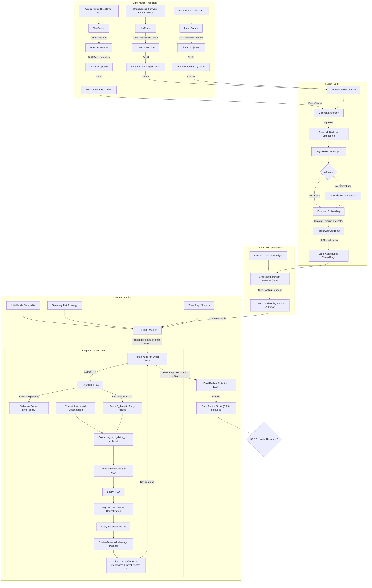

# Project 301: Hardware-Enforced Preemptive Containment Redirection Platform

<p align="center">
  
  
  
  
</p>

Project 301 is a proactive, hardware-enforced cybersecurity platform designed to transition network security from reactive boundary monitoring to autonomous preemptive containment redirection. Fusing hyper-dimensional deep learning with kernel-level packet inspection (eBPF), programmable switch routing (P4), and secure hardware enclaves (Intel SGX), Project 301 predicts lateral threat propagation in real-time and dynamically reroutes threat traffic into isolated, cryptographically shielded containment nodes.

---

## 📖 Product Vision & Ideology

Traditional intrusion detection and response systems operate **reactively**—analyzing logs and triggering alerts *after* a perimeter breach has occurred. In complex enterprise networks, this latency enables unauthorized actors to propagate laterally across host nodes before defensive rules are updated.

Project 301 breaks this paradigm through a **closed-loop preemptive containment redirection architecture**:
1. **Continuous-Time Threat Forecasting**: Models network propagation as continuous state trajectories on a Temporal Asset Graph (TAG), calculating a **Blast Radius Score (BRS)** for each network node.
2. **Zero-Trust Active Redirection**: When a node's BRS exceeds safety thresholds, the platform dynamically compiles a mutated eBPF traffic control probe and injects redirection rules into the network's P4-programmable switches.
3. **Shielded Isolation & Attestation**: Unauthorized Actor traffic targeting the compromised asset is transparently intercepted and routed to a secure containment node running inside an Intel SGX enclave under Gramine LibOS, preventing lateral host leakage.
4. **ROI Dashboard**: Quantifies the business value of proactive defense by recording incident costs avoided and host preservation hours, writing telemetry statistics directly to a dashboard interface (`website/dashboard.json`).

---

## 🛠️ Core Technology Pillars & Code Mappings

The platform is structured into distinct, self-contained components located within the `/src` directory:

### 1. Multi-Modal Neuro-Symbolic Ingestion (`src/project301/models/neuro_symbolic.py`)
To capture diverse indicators of compromise, Project 301 ingests and fuses three data modalities:
* **Unstructured Threat Text**: STIX/CTI threat feeds are tokenized and processed by a 2-layer, 2-head BERT transformer (`BertModel`) to generate text semantic embeddings.
* **Unauthorized Software Binary Hex**: Hex frequency analysis maps executable samples into normalized frequency distributions.
* **Architecture Diagrams**: Network maps and layout blueprints are parsed into RGB hashing representations.

The modalities are merged using **Multihead Cross-Attention** where the text embeddings act as the *Query* ($Q$) and the concatenated hex/image features represent the *Key* ($K$) and *Value* ($V$).

#### Neuro-Symbolic Logic & Z3 Constraints
To guarantee that the model's output satisfies hard safety rules, the fused representation passes through a `LogicSolverModule`. This module uses the **Z3 Theorem Prover** to enforce first-order logic constraints over probabilistic threat dimensions (e.g., compromise probability $c$, susceptibility $s$, and implication risk $imp$):

$$
\text{Implies}(c > 0.5 \land s > 0.5, imp \ge 0.8)
$$

If Z3 detects an UNSAT condition, it solves for the nearest convex boundary projection. Gradients are propagated through the solver during training using a **Straight-Through Estimator (STE)**:

$$
\text{fused}_{\text{bounded}} = x - x.\text{detach}() + x_{\text{convex}}
$$

A **Graph Isomorphism Network (GIN)** processes the verified causal DAG relationships to output a permutation-invariant threat representation vector $Z_{\text{threat}}$.

### 2. Continuous-Time Graph Neural Network (`src/project301/models/ct_gode.py`)
Asset state propagation is modeled as a system of continuous-time differential equations running on a Temporal Asset Graph (TAG). The spatial-temporal neighborhood message-passing of node $v$ aggregates incoming edge weights from neighbors $\mathcal{N}(v)$:

$$
\text{messages}_v = \sum_{u \in \mathcal{N}(v)} \alpha_{uv} \cdot h_u
$$

where $\alpha_{uv}$ is a spatial-temporal cross-attention coefficient. To represent threat attenuation, a base-2 exponential decay representing temporal staleness is applied over time interval $t$:

$$
\alpha_{uv}(t) = \alpha_{uv} \cdot 2.0^{-\lambda t}
$$

Additionally, the GIN threat representation vector $Z_{\text{threat}}$ is mapped to exposed initial entry ports by matching nodes where the index satisfies $src\_node \pmod 3 == 0$.

### 3. Custom Runge-Kutta 4th Order ODE Solver (`src/project301/models/ode_solver.py`)
To avoid heavy external numerical integration wrappers, Project 301 implements a pure PyTorch 4th-Order Runge-Kutta (RK4) ordinary differential equation solver.
Given the derivative function $f(t, y) = \frac{dh}{dt} = \text{ReLU}(W_{\text{out}}(\text{messages}) + Z_{\text{threat}}) - h$, the solver integrates the asset state trajectory:

$$
k_1 = f(t, y)
$$


$$
k_2 = f\left(t + \frac{dt}{2}, y + \frac{dt}{2} k_1\right)
$$


$$
k_3 = f\left(t + \frac{dt}{2}, y + \frac{dt}{2} k_2\right)
$$


$$
k_4 = f(t + dt, y + dt k_3)
$$


$$
y_{i+1} = y_i + \frac{dt}{6} (k_1 + 2k_2 + 2k_3 + k_4)
$$

The final integrated state $h_{\text{final}} = h_t[-1]$ is projected to compute the Blast Radius Score (BRS) per asset node:

$$
\text{BRS} = \sigma(W_{\text{brs}} h_{\text{final}} + b_{\text{brs}})
$$

### 4. Polymorphic eBPF Traffic Shaper (`src/ebpf/tc_shaper.c`)
Enforcement at the local host level is driven by an eBPF program hooked to kernel Traffic Control (`tc`) interfaces. 
The probe reads the active `compromised_ips` and `ctgode_weights` maps. To prevent host performance degradation, the shaper evaluates threat weight decay using bitwise shifts:

$$
\text{decayedWeight} = \text{weight} \gg (\Delta t \times \lambda)
$$

* **Staleness Drop**: If the decayed weight falls below 25, the threat data is considered stale, and the shaper drops incoming packets via `XDP_DROP`.
* **Semantic Shaping**: If the decayed weight is $\ge 25$, for TCP SYN packets, it swaps headers and fabricates a TCP SYN-ACK response, returning it via `XDP_TX` with a computed sequence number:

$$
\text{SEQ} = \text{saddr} \oplus \text{daddr} \oplus \text{decayedWeight} \oplus (\text{currentTime} \pmod{2^{32}})
$$

* **Isolation**: All other non-SYN TCP packets targeting the compromised asset are immediately dropped (`XDP_DROP`).

### 6. P4 ASIC Controller & TEE Enclave (`src/p4/containment_router.p4`, `src/sgx/sgx_enclave.c`)
At the hardware layer, a P4 programmable switch program rewrites packet headers at ASIC speeds. It uses a `containment_redirection_table` to match destination IPs of compromised hosts and executes a `redirect_to_containment_node` action to rewrite MAC addresses and route traffic out a dedicated containment node egress port.

The containment node applications run within a Trusted Execution Environment (TEE) shielded by Intel SGX under a Gramine manifest (`src/sgx/project301_sgx.manifest.template`). The control plane enforcer cryptographically attests the compiler enclave via `attest_enclave` with AES-128-GCM shielding, validating the compiled eBPF binaries' hashes (`compile_in_enclave`) before loading them into the kernel to prevent host privilege escalation.

---

## 📊 System Architecture Diagrams

### 1. End-to-End Machine Learning Pipeline
This diagram traces the flow from multi-modal inputs, cross-attention fusion, Z3 logic constraints, and GIN embeddings to RK4 ODE simulation and GAN-based counterfactual stress testing:



---

### 2. Zero-Trust Hardware Enforcement & Remediation Loop
This diagram maps how the control plane updates the kernel maps, switch ASIC tables, and SGX-shielded containment nodes to isolate compromised nodes:

```mermaid
graph TD
    classDef control fill:#f9f,stroke:#333,stroke-width:2px,color:#000000;
    classDef hardware fill:#bbf,stroke:#333,stroke-width:2px,color:#000000;
    classDef kernel fill:#fbb,stroke:#333,stroke-width:2px,color:#000000;
    classDef enclave fill:#bfb,stroke:#333,stroke-width:2px,color:#000000;

    subgraph Control_Plane
        CT_GODE["CT-GODE Neural Engine"]
        P4_Ctrl["P4AsicController"]:::control
        XDP_Ctrl["ZeroTrustController"]:::control
        Poly_Comp["PolymorphicCompiler"]:::control
    end

    subgraph SGX_TEE
        Attestation["Enclave Attestation"]:::enclave
        Mem_Encrypt["AES-GCM Memory Shield"]:::enclave
        Obj_Verifier["compile_in_enclave Verifier"]:::enclave
    end

    subgraph ASIC_Layer
        P4_Ingress["MyIngress Parser"]:::hardware
        Dec_Table{"containment_redirection_table Match"}:::hardware
        P4_Fwd["ipv4_forward"]:::hardware
        P4_Redirect["redirect_to_containment_node"]:::hardware
    end

    subgraph Kernel_Layer
        XDP_Hook["XDP: semantic_shaper"]:::kernel
        Map_Comp["compromised_ips Map"]:::kernel
        Map_Weights["ctgode_weights Map"]:::kernel
        Decay_Check{"BRS Weight Decay Calc"}:::kernel
        PMU_Prog["perf_event: bpf_pmu_monitor"]:::kernel
        PMU_Map["pmu_ringbuf Map"]:::kernel
    end

    %% Flow lines - Ingress & Routing
    Unauthorized Actor["Unauthorized Actor / Inbound Traffic"] -->|1. Packets| P4_Ingress
    P4_Ingress --> Dec_Table
    Dec_Table -->|No Match| P4_Fwd
    Dec_Table -->|Matched compromised_ip| P4_Redirect
    P4_Redirect -->|2a. Route to TEE Containment Node| Containment Node["SGX-Shielded Containment Node"]
    P4_Fwd -->|2b. Forward to Host Node| XDP_Hook

    %% Flow lines - Local Node Datapath
    XDP_Hook -->|Lookup Node ID| Map_Comp
    Map_Comp -->|Not Compromised| Pass["XDP_PASS to TCP/IP Stack"]
    Map_Comp -->|Compromised| Map_Weights
    Map_Weights --> Decay_Check
    Decay_Check -->|BRS Decayed Under 25 or Stale| Drop["XDP_DROP Packet Isolation"]
    Decay_Check -->|BRS Decayed Over 25 and TCP SYN| TX["XDP_TX: Fabricate SYN-ACK"]
    Decay_Check -->|BRS Decayed Over 25 and Non-SYN TCP| Drop

    %% Telemetry Loop
    PMU_Prog -->|Capture Cache/TLB/Branch Misses| PMU_Map
    CT_GODE -->|3. Read Telemetry and Topology via libbpf| PMU_Map
    CT_GODE -->|4. Detects Compromised Assets| Poly_Comp

    %% Control Plane Integration & Attestation
    Poly_Comp -->|5a. Compile Mutated C| Clang["clang compiler"]
    Clang -->|5b. Mutated .o ELF Binary| Obj_Verifier
    Obj_Verifier -->|5c. Cryptographically Attest Hash| Attestation
    
    P4_Ctrl -->|6a. Secure gRPC / mTLS Table Injection| Dec_Table
    P4_Ctrl -->|6b. Enclave Attestation Check| Attestation
    
    XDP_Ctrl -->|7a. Update BPF Maps natively via libbpf| Map_Comp
    XDP_Ctrl -->|7b. Update BPF Maps natively via libbpf| Map_Weights
    XDP_Ctrl -->|7c. Enclave Attestation Check| Attestation

    %% Memory Encryption
    CT_GODE -.->|8. Encrypted Message Passing| Mem_Encrypt
```

---

## ⚙️ Installation & Build Lifecycle

### Prerequisites
Before compilation, install the required packages.

* **Ubuntu / Debian**:
  ```bash
  sudo apt-get update
  sudo apt-get install -y build-essential make clang llvm libbpf-dev \
                          libssl-dev texlive-latex-base pandoc \
                          python3-venv python3-dev libc6-dev-i386
  ```
* **RedHat / CentOS / Fedora**:
  ```bash
  sudo dnf install -y make clang llvm libbpf-devel openssl-devel \
                      pandoc texlive python3-pip python3-devel
  ```

### Step 1: Virtual Environment Setup
Project 301 isolates its machine learning and testing runtimes into dedicated virtual environments.
```bash
# Clone and enter the repository
cd teamwork_projects/project301

# Create and provision the production virtual environment
python3 -m venv venv
source venv/bin/activate
pip install -r requirements.txt
```

### Step 2: Build Native Artifacts (Makefile)
The project utilizes a root `Makefile` to compile the host kernel modules, SGX enclaves, and documentation:
```bash
# 1. Compile eBPF Traffic Shaper and PMU Monitor kernel object files
make ebpf

# 2. Compile SGX Enclave shared library with OpenSSL fallbacks
make sgx

# 3. Compile P4 Containment Node Router routing rules (requires local p4c or Docker)
make p4

# 4. Rebuild patents, marketing whitepapers, and pitch deck PDFs
make phase3
```

### Step 3: Run the Application
The platform can be run in two modes:

#### Option A: FastAPI Production Dashboard Backend
The production backend server coordinates active telemetry mapping, model execution, and serves the dashboard UI. Run the automatic setup and run script:
```bash
./setup_and_run.sh
```
This script automatically:
* Provision/Verify the virtual environment (`venv`).
* Downloads offline Fallback STIX dataset under `data/threat_intel/` via `mitre_fetcher.py`.
* Starts the production API server.

Access the live dashboard in your browser at:
`http://localhost:8000`

#### Option B: CLI Triage Simulation
To run an interactive command-line simulation of the prediction and remediation loop:
```bash
PYTHONPATH=src python3 src/project301/main.py
```

#### Option C: Production Docker Deployment
To launch the complete containerized dashboard with high-privilege kernel mappings:
```bash
docker-compose up --build
```

---

## 💡 Quickstart Programmatic Usage

Below is a self-contained, end-to-end Python script demonstrating how to instantiate the neuro-symbolic pipeline, fetch live telemetry, and execute continuous-time threat forecasting programmatically:

```python
import torch
from project301.models.neuro_symbolic import NeuroSymbolicPipeline
from project301.models.ct_gode import CT_GODE
from project301.telemetry.linux_pmu import LiveTelemetry

# 1. Initialize the Neuro-Symbolic Ingestion and Fusion Pipeline
# Dimensions: BERT Text (768), Hex Binary (256), Image Layout (512), Hidden Embeddings (128)
pipeline = NeuroSymbolicPipeline(text_dim=768, binary_dim=256, image_dim=512, hidden_dim=128)

# 2. Initialize the Continuous-Time Graph GNN Model
ctgode = CT_GODE(hidden_dim=128, threat_dim=128)

# 3. Ingest Physical Threat Intelligence Data
from project301.ingestion.parsers import TextParser, HexParser, ImageParser

text_parser = TextParser(embedding_dim=768)
hex_parser = HexParser(embedding_dim=256)
image_parser = ImageParser(embedding_dim=512)

text_intel = text_parser.parse(["data/threat_intel/stix_report.txt"])
binary_intel = hex_parser.parse(["data/threat_intel/unauthorized_software_dump.bin"])
image_intel = image_parser.parse(["data/threat_intel/arch_diagram.png"])
threat_dag_edges = torch.tensor([[0, 1], [1, 0]], dtype=torch.long) # Vulnerability graph

# Run ingestion, cross-attention fusion, and Z3 logic checking to compute threat context
z_threat = pipeline(text_intel, binary_intel, image_intel, threat_dag_edges)

# 4. Fetch Active Host Network Topology & PMU Cache Telemetry
telemetry = LiveTelemetry(num_assets=5)
h0 = telemetry.read_cpu_stats()               # Retrieves PMU cache misses (5 assets, 128 dim)
edge_index = telemetry.read_network_topology() # Fetches active TCP connections from BPF maps

# 5. Simulate Threat Trajectories using RK4 Solver over continuous time
# We integrate the ODE state system from t=0.0 to t=1.0 over 10 steps
t_span = torch.linspace(0.0, 1.0, steps=10)
blast_radius_scores = ctgode(h0, edge_index, z_threat, t_span)

# 6. Evaluate Predictive Blast Radius Score (BRS) per Asset
print("=== Predictive Threat Blast Radius Scores ===")
for node_idx, score in enumerate(blast_radius_scores):
    print(f"Asset Node #{node_idx}: BRS = {score.item():.4f}")
    if score.item() > 0.05:
         print(f"  --> ALERT: Node #{node_idx} exceeds threshold. Remediating via eBPF/P4...")
```

---

## 🧪 Automated Testing & Environment Configuration

Project 301 comes with a robust test suite that validates feature correctness, mathematical stability boundaries, and hardware-in-the-loop (HIL) scenario routing.

To isolate dependencies and run the complete test suite:
```bash
./run_tests.sh
```
This executes `pytest` over the `tests/` directory.

### Environment Control Flags

During local execution or testing, configure the system behavior using the following environment variables:

| Environment Variable | Default Value | Description |
|---|---|---|
| `MOCK_HW` | `0` (set to `1` in tests) | **Hardware Emulation Mode**: Bypasses direct interactions with interface network offloading or active eBPF map modifications. Allows tests to execute in unprivileged CI/CD containers without root/sudo access. |
| `REQUIRE_REAL_SGX` | `0` | **Strict SGX Hardware**: When set to `1`, forces loading the actual SGX enclave shared library and performing hardware attestation. If unset, enclaves fallback to hardware-agnostic OpenSSL cryptographic paths. |
| `PROJECT301_NO_SUDO` | (Not Set) | **Suppress Sudo**: Disables prompt queries for administrative permissions during test phases or document compilation in Docker. |
| `PROJECT301_MOCK_TELEMETRY` | (Not Set) | **Telemetry Replay Mode**: Forces the telemetry library to load offline traffic metric replays instead of polling `/sys/fs/bpf/pmu_ringbuf`. Useful for offline incident forensics. |

---

## 🗂️ Repository Directory Structure

```
/
├── Dockerfile                         # Production API container image spec
├── Makefile                           # Compile probes, enclaves, switch setups, & documents
├── README.md                          # Platform documentation portal (this file)
├── docker-compose.yml                 # Orchestration setup for FastAPI Dashboard
├── requirements.txt                   # Production Python package dependencies
├── setup_and_run.sh                   # Main script to provision virtual env and run FastAPI app
├── run_tests.sh                       # Isolated test env builder and test suite executor
│
├── src/                               # Main source files
│   ├── ebpf/                          # Kernel-level C programs
│   │   ├── tc_shaper.c                # XDP-level Semantic traffic shaper
│   │   └── pmu_monitor.c              # perf_event CPU Performance Monitor Unit probe
│   │
│   ├── p4/                            # Hardware router programs
│   │   └── containment_router.p4         # P4 Switch ASIC containment redirection routing rules
│   │
│   ├── sgx/                           # Trusted Execution Environment C sources
│   │   ├── sgx_enclave.c              # SGX attestation, AES memory shield, and ELF verifier
│   │   └── project301_sgx.manifest    # Gramine LibOS deployment configurations
│   │
│   └── project301/                    # Core Python modules
│       ├── main.py                    # CLI simulation launcher
│       ├── api/                       # REST/WebSocket API endpoints
│       │   └── production_api.py      # FastAPI server & live web telemetry dashboard
│       ├── models/                    # PyTorch artificial intelligence architectures
│       │   ├── ode_solver.py          # Custom Pure PyTorch Runge-Kutta 4th-Order Solver
│       │   ├── ct_gode.py             # Continuous-Time Graph GNN (C-TGNN) threat propagation
│       │   ├── neuro_symbolic.py      # Multi-modal fusion with Z3 logic constraint solvers
│       ├── orchestration/             # Kernel and hardware controller managers
│       │   ├── bpf_injector.py        # ZeroTrustController & P4AsicController
│       │   ├── dynamic_compiler.py    # Compiler wrapper and SGX attestation verifier
│       │   └── roi_dashboard.py       # Cost avoidance and metric calculations
│       └── telemetry/                 # Telemetry interfaces
│           └── linux_pmu.py           # PMU/TCP connection reader (BPF Map bindings)
│
├── tests/                             # Quality assurance test suites
│   ├── test_ode_solver.py             # Validates RK4 solver accuracy and non-divergence
│   ├── test_ct_gode.py                # Assesses continuous graph GNN propagation paths
│   ├── test_neuro_symbolic.py         # Tests multi-modal fusion and Z3 bounds logic
│   ├── test_kernel_integration.py     # Assesses eBPF map interaction stability
│   ├── test_sgx_enclave.py            # Tests attestation and memory page encryption
│   └── test_website_e2e.py            # Playwright dashboard e2e tests
│
└── docs/                              # Legal, documentation, and audit trails
    ├── patent/                        # Provisional patent LaTeX files & compilation scripts
    ├── whitepaper/                    # Business whitepaper documents and pitch decks
    └── audits/                        # Persona-based validation reports and critiques
```
